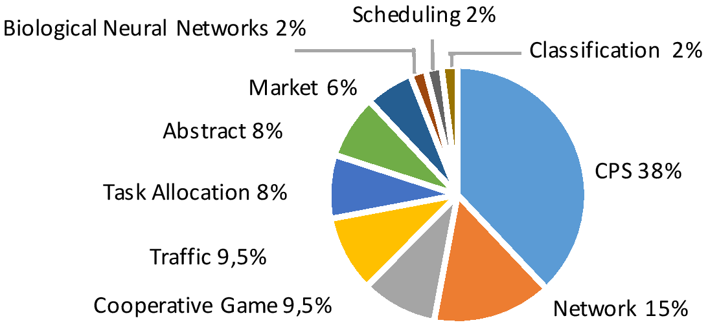
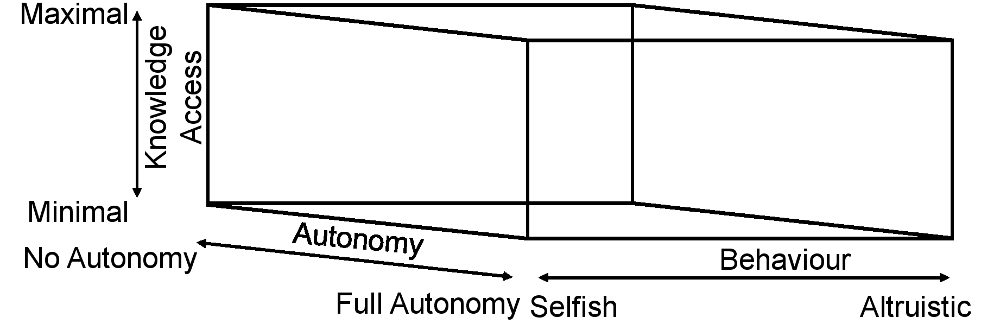
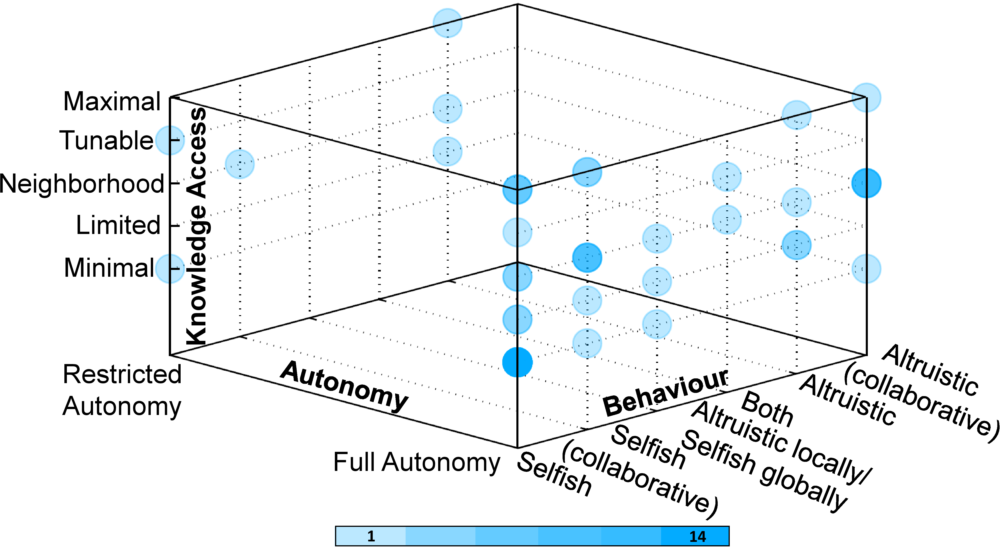
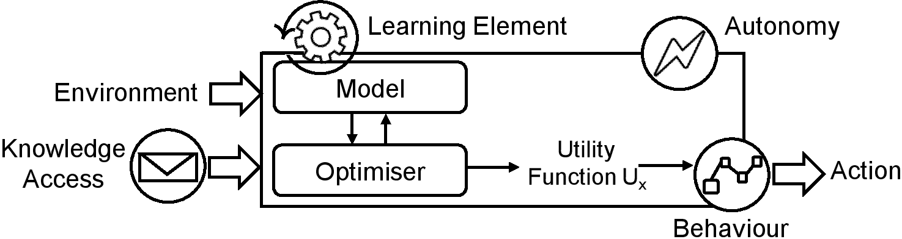

# Learning in Collective Self-adaptive Systems
**Collective self-adaptive systems (CSAS)** are distributed and interconnected systems composed of multiple agents that can perform complex tasks. By providing individual agents with learning capabilities, CSAS can cope with challenges related to distributed sensing and decision-making, and operate in uncertain environments. Although learning has been explored in many CSAS applications, selecting suitable learning techniques and models remains a significant challenge.

# Goal
The goal of our systematic literature review is to understand the state of practice on how learning is employed in CSAS. To this end, we investigate related research that involve the development of CSAS employing learning techniques. We are particularly interested in the studies employing learning in CSAS to enable agents to adapt their behavior when encountering scenarios unanticipated at design time.

# Research Questions

- **RQ1**: What are the characteristics of the described CSAS?
  - Application Domain (**RQ1**): classify the domain of the
developed CSAS application;
  - Agents (**RQ1**): identify agents within the collective with
learning abilities;
  - Autonomy (**RQ1**): determine whether agents act autonomously
or are supervised by external entities;
  - Knowledge Access (**RQ1**): assess the amount of information
provided to an agent by its peers;
  - Behaviour (**RQ1**): evaluate how an agent behaves with
respect to other agents’ behaviour;

- **RQ2**: What is the purpose of learning?
  - Learning Tasks (**RQ2**): establish the objectives of learning
by an agent and the collective;
  - Emergent Behaviour (**RQ2**): determine which characteristics
emerge from agents’ interactions and are observed as outcomes of agents’ behaviour;

- **RQ3**: Which are the selected learning techniques?
  - Learning Technique (**RQ3**): classify the techniques used
by agents to enable learning;

- **RQ4**: What are the triggers for updating learning models?
  - Learning Trigger (**RQ4**): identify the triggers driving
knowledge processing and refinement of learning models.

# Research Method
Our investigation is made by means of a systematic literature review (SLR) of 52 related research papers out of 215 preliminary candidates.

**Replication package**: The following [link](https://drive.google.com/open?id=1tkX0cTYFzkTWq-KWRimPkrowaW_ZvoRs) points to the replication document.

**Collected Data**: The following [link](https://docs.google.com/spreadsheets/d/1tD9yaWa7JfokEHNGdw5sMem09e-y5FuAhfuI7Av2VYw/edit#gid=1392946669) points to the analysed literature and corresponding data collected in a Google sheet.

# Results
Based on the analysis of the selected studies, we report here our findings.

## Application Domain
The most dominant applications are cyber-physical systems (CPS) such as robotics, sensor systems and smart energy applications.
This is inline with the increasing interest in CPS, especially in the area of self-adaptive systems. Network-based applications
are the second most explored domain. Other applications include traffic scenarios, cooperative games, and market applications. Finally, four studies describe the solution to learning in CSAS using abstract multi-agent organisational models but do not report any concrete applications.

  

## Learning Purpose
We identified two main groups regarding the relation between learning tasks and emergent behaviour. One group concerns studies that associate the emergent behaviour to the exact anticipated learning task of the collective. The learning task in these studies is either a collection of individual non-collaborative tasks (e.g., each soccer agent scoring a goal on their own) or a system-wide collaboration among the agents (e.g., smart sensors collaborating to patrol an area successful). In the other group of studies, collaboration between the agents emerges to a different behaviour than the anticipated learning task. These studies often define learning tasks as individual goals for the agents and agents are not aware of any implicit collaboration among them. As a result, a system-wide collaboration emerges.

## Learning Techniques and Triggers
Reinforcement Learning (RL) is a widely used technique in CSAS. The results from our review highlight that ~60% of the selected studies use RL. The wide adoption of RL in CSAS lies in its simple and straightforward resemblance between the actions and rewards of its theoretical model and the behaviour of agents in the employed application domains. Most importantly, RL techniques (e.g., Q-learning, W-learning) do not necessarily need a model of the environment and can learn directly from raw experience. Game Theory (GT) and Supervised Learning (SL) techniques are used in ~10% of the reviewed studies. Moreover, that ~8% of the studies uses probabilistic approaches, while two other studies use applied logic and evolutionary processes. Finally, swarm systems are used for collective self-organisation in two studies.

  

Our analysis of the selected CSAS studies targeted the identification of when gathered knowledge is initially exploited and when learning models are updated. The trigger for instantiating the initial learning model typically occurs upon launching a new learning task, whereas event-based triggers are primarily used for updating the models. However, we could not find an optimal class of event-based triggers capable of improving model accuracy and driving efficient achievement of the CSAS objectives.

  

## Relation between Domain-Agents-Learning Task-Emergent Behaviour-Paper

**NOTE:** Papers are identified by unique numbers in our [literature review](https://docs.google.com/spreadsheets/d/1tD9yaWa7JfokEHNGdw5sMem09e-y5FuAhfuI7Av2VYw/edit#gid=1392946669)

## A 3D Framework of CSAS: Autonomy, Knowledge Access, and Behaviour

  

* We define CSAS **autonomy** to be the level of self-authorisation provided to agents within the collective. An agent is autonomous when there is no external or internal (i.e., by other agents) control over its behaviour.

* Our analysis reveals that some agent-based models explicitly exchange learning information with each other. We call this concept **knowledge access**.

* The **behaviour** of agents within a CSAS indicates whether an agent has the objective to maximise its own utility, i.e., it is selfish, to maximise the CSAS utility, i.e., it is altruistic, or adopts an intermediate role.

  

These characteristics are the basis for a proposed framework composed of three dimensions. These dimensions provide a clear understanding of the assumptions that can be made about agents that are part of CSAS, and allow making design decisions on how agents should learn. scatter plot indicating how the CSAS applications are spread over the dimensions of the proposed 3D framework. Agents are typically considered selfish while varying levels of knowledge access are commonly explored. There is, however, limited work exploring agents with restricted autonomy. We only found six studies, located in corners, where agents have restricted autonomy. There is no study exploring selfish agents with maximal knowledge access or altruistic agents with minimal knowledge access. The lack of research in these areas of our 3D framework is interesting since these settings can naturally occur in realworld applications

  

## Canonical View of the Learning Process of a CSAS Agent

Learning-based CSAS agent is designed to improve its ability to fulfil the learning task. The learning element takes
environmental and internal observations as inputs and generates an action (leading to CSAS reconfiguration) as output. Internally, a utility function Ux is employed to characterise the desirability of the agent’s behaviour. Furthermore, the learning element contains a model (e.g., a classifier) and an optimisation (or controller) component that decides about the actions optimising the employed utility function.

  

1. Depending on the level of **autonomy**, the agent’s decisions may be overruled, changed, or blocked by external intervention; 
2. Depending on the level of **knowledge access**, information from other agents may be available in addition to the local view of internal and environmental information;
3. Depending on the **behaviour** type, the definition of a utility function Ux may vary between favouring agent and/or system-wide utility.

## Conclusion
Our systematic review of learning-enabled CSAS shows that behavioural and collaboration modalities are perplexed when
learning is required. This reveals that learning tasks, emergent behaviour, learning techniques and triggers play a key role when designing learning-enabled CSAS. Minimal knowledge access, high autonomy and the prevalence of reinforcement
learning are some key characteristics that we observe, together with their use in CPS. Based on these findings, we introduce a 3D framework capturing the characteristics of learning-enabled CSAS. Given the dimensions of autonomy, knowledge access and behaviour, we present a canonical view of the learning process with which applications and learning implications can be classified, and discuss how these implications are different to those in centralised-controlled CSAS. Open challenges such as the design of collaborative learning techniques, privacy and accountability in open environments without trusted third parties, the resilience, fault-tolerance and provision of assurances of learning in distributed environments are highlighted as opportunities for future work.
